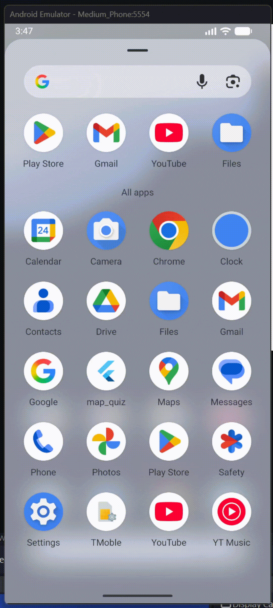
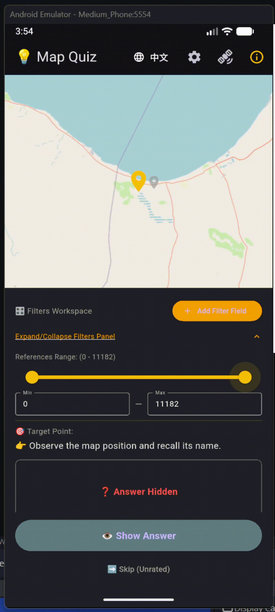
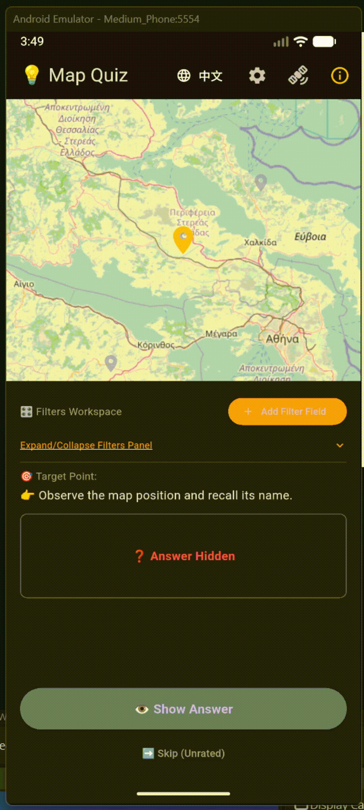
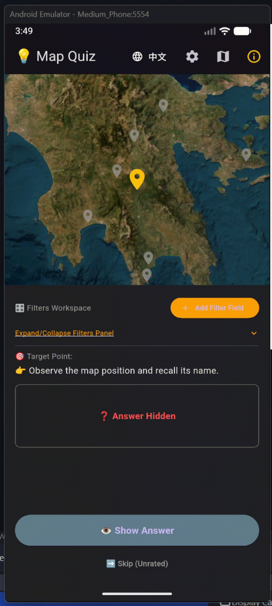

# MapQuiz
An Android App to test geographical knowledge. Support custom GeoJSON import.

Designed specifically for Historical Geography and Classical Archaeology. It aims to overcome memory bottlenecks associated with large-scale site coordinates and highly cited reference locations in academic literature, fostering solid geospatial intuition through interactive visualization.

Powered by Flutter, Leaflet & SharedPreferences Local Database Cache.

Developed by Sunhao Zhang (Vibe Coding with Google Gemini).

Map data provided by Openstreetmap and ArcGIS World Imagery (Satellite Image).

Users can import their own GeoJSON into the application. For the Ancient Mediterranean, a GeoJSON dataset has been provided by the ToposText Project, see: https://topostext.org/TT-downloads.

The current v1.0 supports Android and Web App.

## Contact

Any question or suggestion is welcome. Contact: sunhao03@student.ubc.ca.

## Demo

**<u>Initialize</u>**

**<u>Data filtering</u>**

**<u>Test your knowledge</u>**

